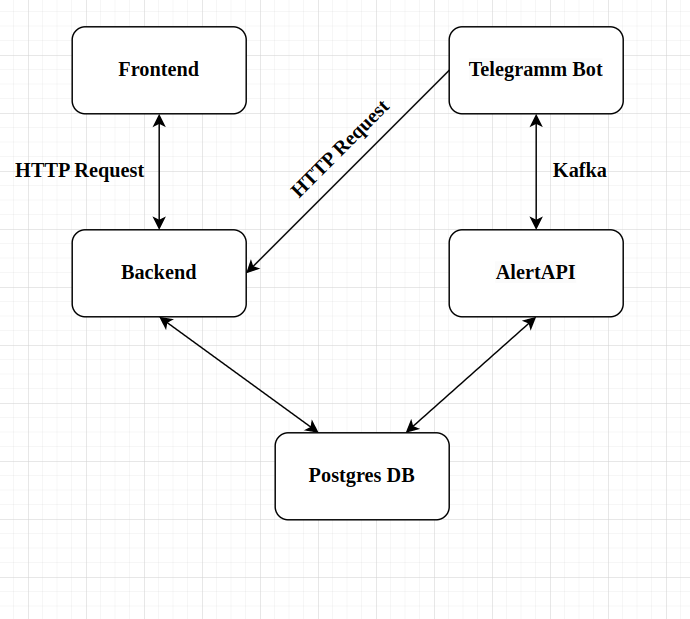

# AlertSystem

## Оглавление
1. [Описание проекта](#description)
1. [Сборка и запуск проекта](#build)
1. [Ссылки на первоначальные репозитории](#links)

## Описание проекта 

Данный проект был разработан для создания системы оповещения об непредвиденном поведение в коде.

Проект имеет следующую структуру:

Конечный пользователь взаимодействует с Frontend, AlertAPI, Telegramm Bot:

- На сайте пользоваль регистрируется и заводит проекты.
- AlertAPI пользователь может интегрировать в свои проекты на любом языке программирования;
- Telegramm Bot добавляется в чаты проектов и присылает оповещения(требует авторизации).

Для использования AlertAPI ознакомьтесь с Swagger аннотацией: AlertAPI/Swagger.json

**Для тех копу лень смотреть Swagger:**

В API существую пока только 2 POST запроса к AlertAPI:

1. /alert/byRole/{role} - отправить оповещения по роли (может отправить одинаковое оповещение нескольким разработчикам).

    Имеет следующее тело: 
    ~~~
    {
        "idProject":1,
        "alertType": "email",
        "message": "test email alert by role",
        "alertPath": "no code"
    }
    ~~~
1. /alert/byId/{id} - отправить оповещения по id.

    Имеет следующее тело: 
    ~~~
    {
        "idProject":1,
        "alertType": "telegram",
        "message": "test telegram alert by id",
        "alertPath": "no code"
    }
    ~~~

Ответом на оба этих запроса будет следующий json:

~~~
{
    "status": "String"
}
~~~

## Сборка и запуск проекта 

Для сборки проекта используется Maven. Поэтому, чтобы собрать проект его нужно установить.

Linux: 
~~~
sudo apt install maven
~~~

Затем перейдите в папку, куда был склонирован репозиторий, и запустите скрипт build_and_run.sh

После этого у вас соберется проект, автоматически запустится docker-compouse build и docker-compouse up.

## Ссылки на первоначальные репозитории  

1. [AlertAPI](https://github.com/nikic2014/AlertAPI)
1. [Bakend сайта](https://github.com/nikic2014/AlertSystemBackend)
1. [Frontend сайта](https://github.com/nikic2014/FrontendAlertSystem)
1. [Telegramm бот для оповещений](https://github.com/nikic2014/AlertSystemTelegramBot)